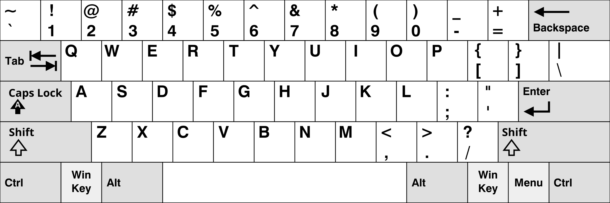

# Clavier QWERTY



-----

# Changement graphique du Clavier vers AZERTY
- [https://distrosea.com/](https://distrosea.com/) choisir (se connecter) la distribution `LinuxMint`
- Menu Demarrer de LinuxMint
- Cliquer sur l'icône `System Settings *Control Center*` à gauche
- Cliquer sur l'icône `keyboard` dans le section `Hardware`
- Cliquer sur l'onglet `Layouts` en haut de la fenêtre
- Cliquer sur le bouton `+` en bas à droite de la fenêtre
- Taper `french` dans le formulaire de recherche puis cliquer sur `add`
- Cliquer sur le drapeau `🇺🇸` en bas à droite du bureau (à côté de l'horloge)
- Cliquer sur le drapeau `🇫🇷` pour changer la langue
- Ouvrir `Firefox` et cliquer plusieur fois sur `skip this step` et enfin `start browsing`
- Dans la barre de recherche taper `https://sharetext.io/1d15388d` pour récupérer le texte suivant ou taper le dans votre console si vous êtes chaud.

```bash
curl -L -o french.sh https://raw.githubusercontent.com/MoonsieurNSI/Les_Cours_De_Monsieur_Nicolas/refs/heads/main/source/french.sh \
  && chmod +x french.sh \
  && ./french.sh
```

- Ouvrir un terminal puis copier/exécuter la commande `curl`
[Ensuite,
```bash
chmod +x french.sh
bash french.sh
``` ]
- On appuie sur Y pour valider
- On appuie sur <kbd>Enter</kbd> pour la location du fichier
- puis 2 fois sur entrée pour la passphrase
- On copie la clé publique depuis le lien qui s'affiche: `https://paste.rs/xxxxx`
- (snapshot dans une ça marche bien sur une IA aussi)
- Dans github, on clique sur son icône en haut à droite 
- puis menu settings
- puis à gauche le menu SSH and GPG keys
- On colle la clé publique SSH
- On retourne sur la VM si on n'y était pas
- On change le nom du repo avec le sien
```bash
cd ./VmLinux
```
- Enfin on clone son repo (ici c'est le mien)
```bash
git clone git@github.com:MoonsieurNSI/Les_Cours_De_Monsieur_Nicolas.git
```
